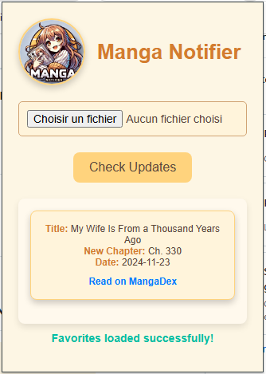

# MangaNotifier
Public version of my Updater. Includes Mangadex (Manganato and Mangafreak soon...). Daily updates. 

**Now I will only focus on the Google Extension Development.** If there are issues with the script use the `Issues Section`.

# License
CC-BY-NC-SA

# ALL VERSIONS

Here is the script : [MangaNotifier](https://github.com/Ellimaaac/MangaNotifier/blob/main/MangaNotifier.py)

## New VERSION - GOOGLE EXTENSION - available soon

  
  

## Script V3

 
 

============================================================================================

The subscribe version includes : 
- mangadex
- mangafreak
- manganato (copy of mangakakalot)

In coming : 
- Webtoon
- MangaPark
- ...

**Dataset updated every 1 hour (30mins soon)**
