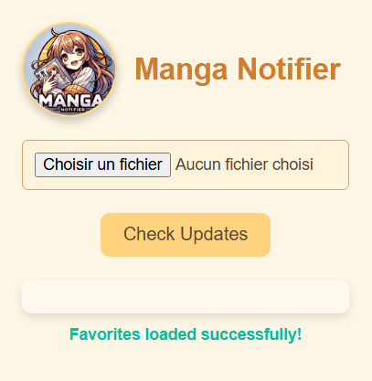

# MangaNotifier
Public version of my Updater. Includes only mangadex. Daily updates.  To get more websites, you have to subscribe.

# License
CC-BY-NC-SA

# ALL VERSIONS

Here is the script : [MangaNotifier](https://github.com/Ellimaaac/MangaNotifier/blob/main/MangaNotifier.py)

## New VERSION - GOOGLE EXTENSION - available soon

  
  

## Script V3

 
 

============================================================================================

The subscribe version includes : 
- mangadex
- mangafreak
- manganato (copy of mangakakalot)

In coming : 
- Webtoon
- MangaPark
- ...

**Dataset updated every 1 hour (30mins soon)**
