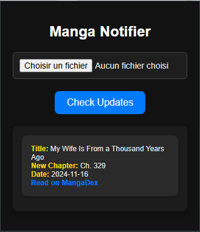
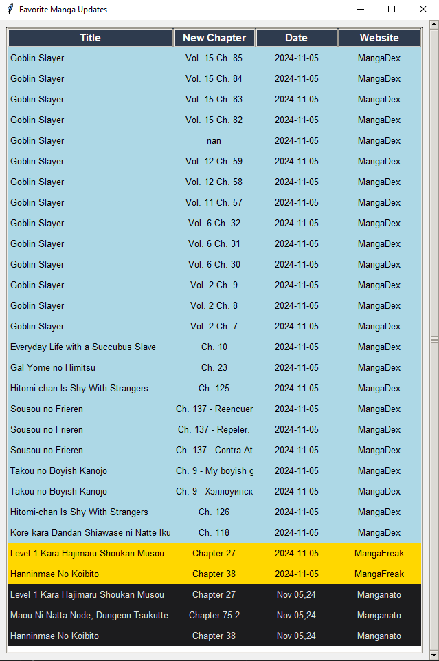

# MangaNotifier
Public version of my Updater. Includes only mangadex Daily updates.  To get more websites, you have to subscribe.

Here is the prog : [MangaNotifier](https://github.com/Ellimaaac/MangaNotifier/blob/main/MangaNotifier.py)

# New VERSION - GOOGLE EXTENSION 

 
 

## License
CC-BY-NC-SA

============================================================================================

The subscribe version includes : 
- mangadex
- mangafreak
- manganato (copy of mangakakalot)

In coming : 
- Webtoon
- MangaPark
- ...

**Dataset updated every 1 hour (30mins soon)**

Here an exemple of the last version (2024-11-03) : 

if the prog print nothing, this means that none of your favourite mangas are updated.

 
 
